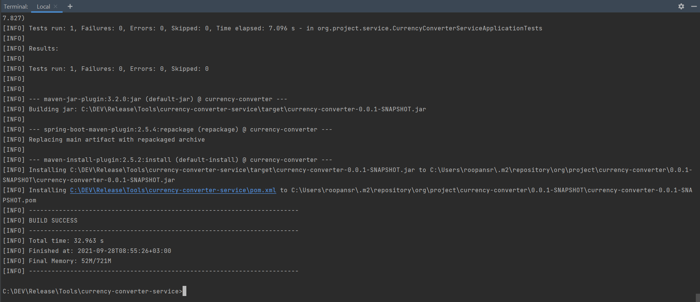
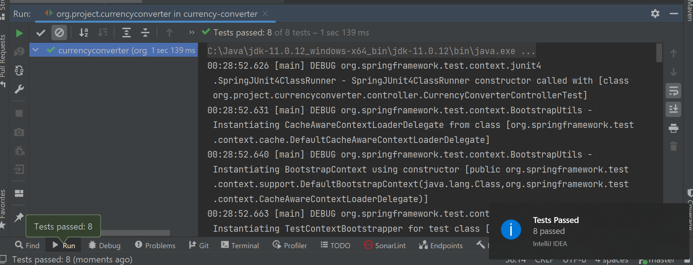
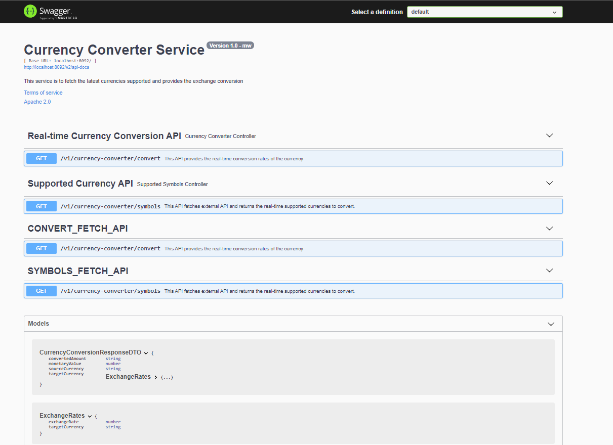
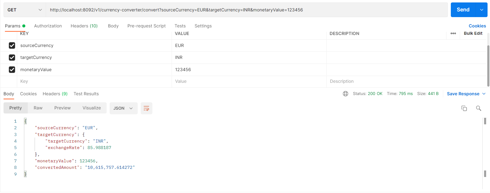
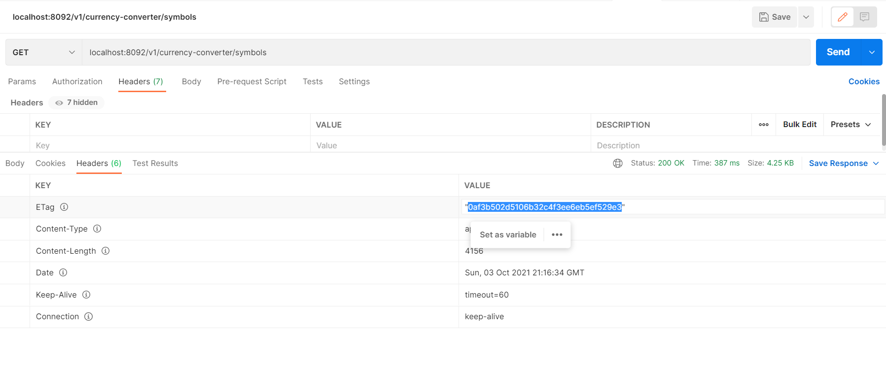
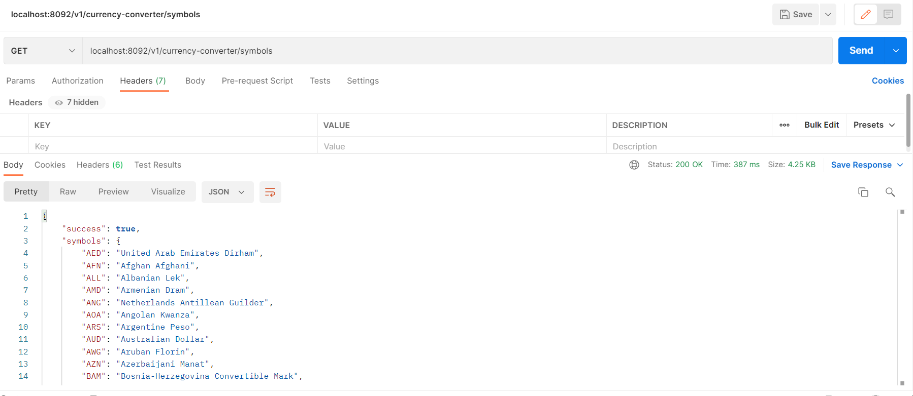
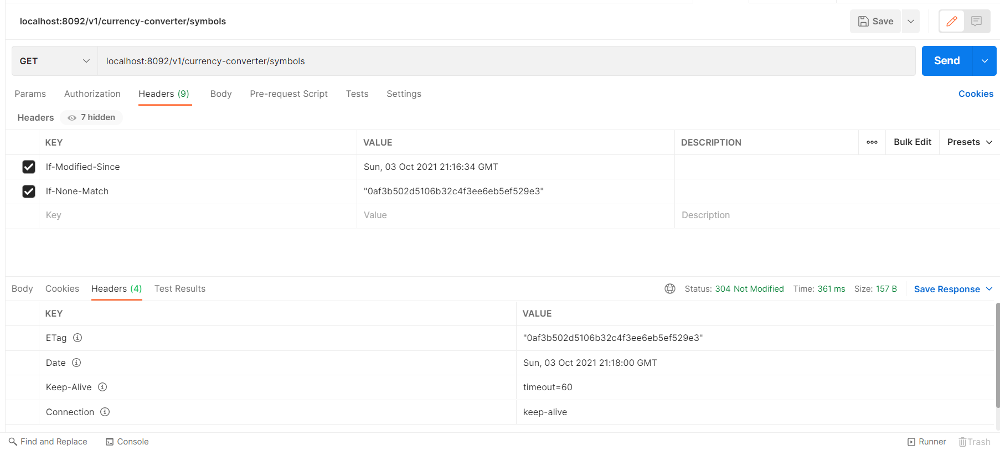
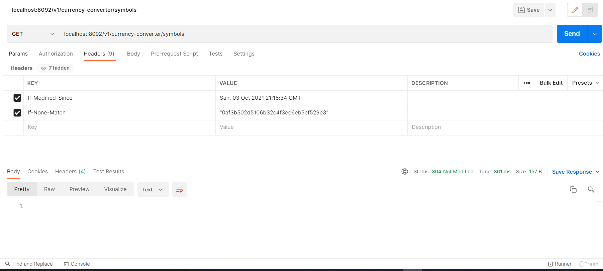
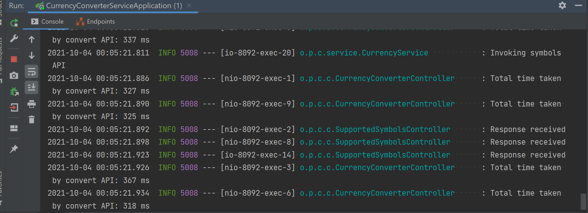

# Currency-converter service

## Prerequisites:

- java 8 or above is installed and it's PATH is configured in the system's environment variable settings
- maven is installed and it's PATH is also configured in the system's environment variable settings.

## Assumptions & Information:

- This is the back-end service that means you can run in Postman in isolation. However, it has also a front-end 
  module, you can use that to leverage this API using GUI [here](https://github.com/rrastogi69556/currency-converter-app.git).
- This alpha version converts the currency into specific region format you pass as header ('Accept-Language'), if 
  you are running in isolation in Postman. However, you can directly select in the GUI for ease.
- Please keep in mind that this application uses third party API 
  [exchangerates api](https://exchangeratesapi.io/documentation/) to 
  fetch rates which means currently, it uses free api key to fetch limited number of responses. If responses crosses 
  certain 
  number of threshold, external api return `429 - too many requests - Your monthly usage limit has been reached. Please upgrade your Subscription Plan.` error code.   
- Currently, in order to save bandwidth - ETag is used. This means that for fetching supported currencies, for first 
  request, it will receive 200 response with content and in the subsequent requests, if the content is not modified, 
  then HttpStatus - 304 (NOT_MODIFIED) response code is returned without content, thereby, saving bandwidth. This makes 
  the response fast as there is no content.

## Build and Run:
- PMD plugin is integrated with maven for static code analysis and force the developers to maintain the code best
  practices at all times. In case it violates standard rules, it fails build.
- In order to build the project go to the root dir which is the same directory where you are viewing this file.
- go to the Terminal and type `mvn clean install` in order to start the build.
  Once completed, go [here](./src/main/java/org/project/currencyconverter/CurrencyConverterServiceApplication.java) and 
  right 
  click 
  -> Run this application. Alternatively, run `mvn spring-boot:run`
- Then, visit `http://localhost:8092` in browser, or `http://localhost:8092/v2/api-docs` in POSTMAN for the Swagger 
  documentation.  
  
  - Snapshots: 
    - Build: 
  
    - Junits:
      
    - Postman documentation:    
    
    - convert API:  
    
     - Supported Symbols API:    
      
      
      
    
    `Notice the difference above, 4.25 KB in first response and 157B in second response`       
    - Jmeter Performance Response:   
    
  
### Other Considerations:
Please make sure no servers are running as this applications uses below ports :   
- `8092: currency-converter-service`  
- In case you want to change the port, you can change the port from application.properties.  
- maven `settings.xml` - contains no proxy or anything, example:

    `<settings xmlns="http://maven.apache.org/SETTINGS/1.0.0"  xmlns:xsi="http://www.w3.org/2001/XMLSchema-instance"  xsi:schemaLocation="http://maven.apache.org/SETTINGS/1.0.0                      http://maven.apache.org/xsd/settings-1.0.0.xsd">
	<localRepository/>
	<interactiveMode/>
	<usePluginRegistry/>
	<offline/>
	<pluginGroups/>
	<proxies>
    </proxies>
	<servers>
    </servers>
	<mirrors>
	</mirrors>
	<profiles/>
	<activeProfiles/>
    </settings>`