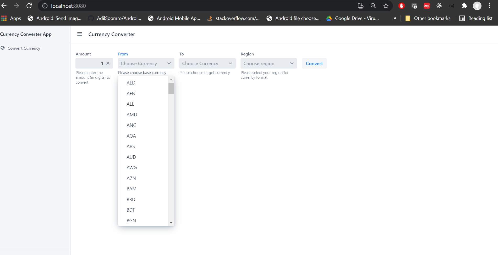
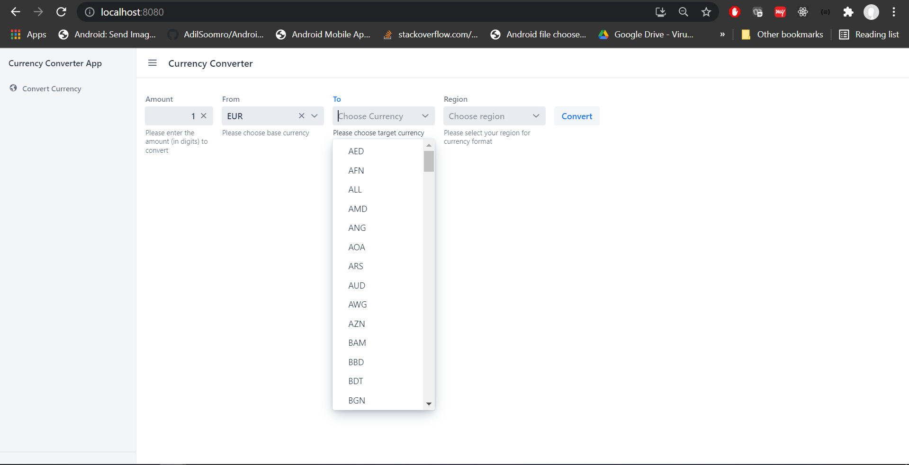
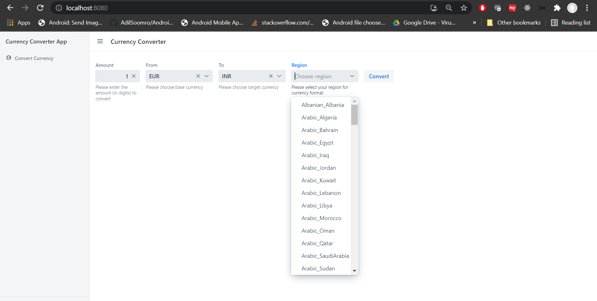
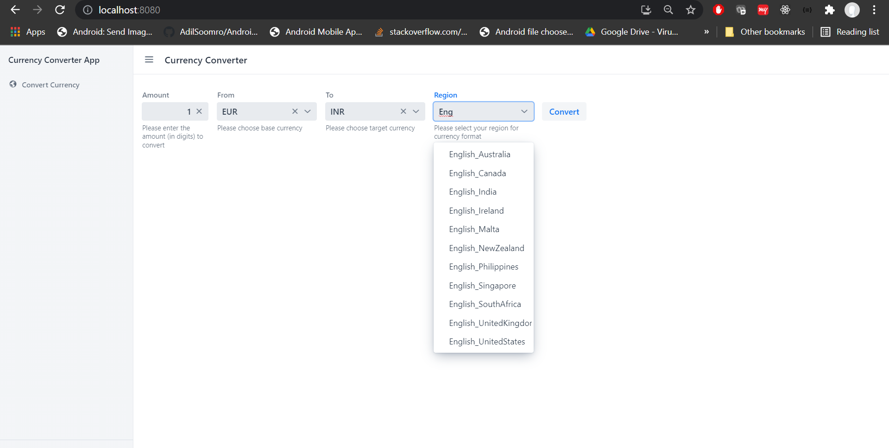

# Currency UI using Vaadin

This project is the presentation tier for the [backend](https://github.com/rrastogi69556/currency-converter.git) to 
make it more loosely-coupled. All business logic of supported currencies, exchanging and converting are handled at 
the backend project.
It uses Java web UI framework called as [Vaadin](https://vaadin.com). This is Spring boot application.

## Assumptions
1. External API for real-time currency conversion is used, which is, 
   [this](https://exchangeratesapi.io/documentation/). Currently, free version is used which has some limitations. Example: some currencies are not 
   convertible from source to target. It displays the error message received from the backend to UI.
   
## Pre-requisites and Setup
- Make sure you have :
  - jdk 8 | jdk1.8.0_121 or above installed.
  - maven installed   
  
## Running the application
- Once above installed - go to the root directory of the project and build :
  - using `mvn clean install`
  - Once build is success in order to run this project -> go to 
    [this class](./src/main/java/org/project/currencyconverter/ui/Application.java) -> Right click -> Run this 
    application.
  - Go to `http://localhost:8080` in browser once application is up and running.  
  - Screenshots:   
    Choose source currency  
      
    Choose target currency  
      
    Choose region in which you want to format currency  
      
      
    Result:  
    
  

## Deploying to Production

To create a production build, call `mvnw clean package -Pproduction` (Windows),
or `./mvnw clean package -Pproduction` (Mac & Linux).
This will build a JAR file with all the dependencies and front-end resources,
ready to be deployed. The file can be found in the `target` folder after the build completes.

Once the JAR file is built, you can run it using
`java -jar target/currency-ui-1.0-SNAPSHOT.jar`

## Project structure

- `MainLayout.java` in `src/main/java` contains the navigation setup (i.e., the
  side/top bar and the main menu). This setup uses
  [App Layout](https://vaadin.com/components/vaadin-app-layout).
- `views` package in `src/main/java` contains the server-side Java views of your application.
- `views` folder in `frontend/` contains the client-side JavaScript views of your application.
- `themes` folder in `frontend/` contains the custom CSS styles.

### Other Considerations:
Please make sure no servers are running as this application uses below ports :   
- `8080: currency-ui`  
- In case you want to change the port, you can change the port from application.properties.  
- maven `settings.xml` - contains no proxy or anything, example:

    `<settings xmlns="http://maven.apache.org/SETTINGS/1.0.0"  xmlns:xsi="http://www.w3.org/2001/XMLSchema-instance"  xsi:schemaLocation="http://maven.apache.org/SETTINGS/1.0.0                      http://maven.apache.org/xsd/settings-1.0.0.xsd">
	<localRepository/>
	<interactiveMode/>
	<usePluginRegistry/>
	<offline/>
	<pluginGroups/>
	<proxies>
    </proxies>
	<servers>
    </servers>
	<mirrors>
	</mirrors>
	<profiles/>
	<activeProfiles/>
    </settings>`

## Useful links

- Read the documentation at [vaadin.com/docs](https://vaadin.com/docs).
- Follow the tutorials at [vaadin.com/tutorials](https://vaadin.com/tutorials).
- Watch training videos and get certified at [vaadin.com/learn/training](https://vaadin.com/learn/training).
- Create new projects at [start.vaadin.com](https://start.vaadin.com/).
- Search UI components and their usage examples at [vaadin.com/components](https://vaadin.com/components).
- Find a collection of solutions to common use cases in [Vaadin Cookbook](https://cookbook.vaadin.com/).
- Find Add-ons at [vaadin.com/directory](https://vaadin.com/directory).
- Ask questions on [Stack Overflow](https://stackoverflow.com/questions/tagged/vaadin) or join our [Discord channel](https://discord.gg/MYFq5RTbBn).
- Report issues, create pull requests in [GitHub](https://github.com/vaadin/platform).
